# MacGuard AI — System Architecture

This document defines the production architecture, component hierarchy, data flow, safety boundaries, and cryptographic models of **MacGuard AI v1.1.0**.

---

## 1. System Design Principles & Philosophy

MacGuard AI is architected as a **safety-critical filesystem intelligence and analytics platform for macOS**. Every layer of the system adheres to eleven foundational engineering principles:

1. **Deterministic Foundations Before AI:** Core storage scanning, risk classification, allowlist validation, duplicate detection, and execution logic are 100% deterministic, testable Python code. The AI agent acts exclusively as an advisory reasoner and natural language explainer.
2. **Read-Only by Default:** The system operates in a non-mutating, read-only state across all exploration, visualization, and conversational modes.
3. **Decoupled Intelligence and Execution:** The AI model is treated as an untrusted proposal generator and possesses **zero authorization to approve, move, or delete files**.
4. **Mandatory Explicit Human Consent:** No file operation occurs without unambiguous, per-item human confirmation displaying the canonical path, size, category, and risk tier.
5. **Cryptographic HMAC-SHA256 Authorization:** Every human approval is sealed with an HMAC-SHA256 signature generated by an ephemeral 256-bit runtime secret key (`ApprovalKeyManager`).
6. **Strict Allowlist Boundary Enforcement:** Destructive actions are restricted to explicit, known-safe allowlisted cache and temporary build roots. System roots and user documents are permanently blocked.
7. **Zero Permanent Deletion Primitives:** The codebase contains zero instances of `os.remove`, `os.unlink`, `shutil.rmtree`, or `rm`. All operations route exclusively to macOS Trash (`~/.Trash`).
8. **Pre- and Post-Mutation Physical Integrity Checks:** Snapshots of file size, inode, modification time, and SHA-256 hashes are captured and re-verified before and after moving to Trash.
9. **Single-Use Replay Protection:** Approval tokens atomically transition from `PENDING` → `APPROVED` → `CONSUMED`. Replay execution attempts fail closed.
10. **Fail-Closed Mechanics:** In any ambiguous state (symlink anomaly, permission error, hash mismatch, expired token), execution immediately halts safely.
11. **Linear Security Gating Axiom:**
    $$\text{DISCOVERY} \neq \text{AUTHORIZATION} \neq \text{RECOMMENDATION} \neq \text{APPROVAL} \neq \text{EXECUTION}$$

---

## 2. High-Level System Architecture

```text
                                  ┌───────────────────────────┐
                                  │           USER            │
                                  └─────────────┬─────────────┘
                                                │
                                                ▼
┌─────────────────────────────────────────────────────────────────────────────────────────────┐
│                                     PRESENTATION LAYER                                      │
│  ┌──────────────────────────────────────────────────┐  ┌─────────────────────────────────┐  │
│  │             Streamlit Web Application            │  │      Command-Line Interface     │  │
│  │   (10 Views: Dashboard, Scan, Dev, Duplicates,   │  │  (Diagnostics, Review, Trash)   │  │
│  │    History, Recs, Review, Exec, Agent, Audit)    │  │                                 │  │
│  └──────────────────────────┬───────────────────────┘  └────────────────┬────────────────┘  │
└─────────────────────────────┼───────────────────────────────────────────┼───────────────────┘
                              │                                           │
                              ▼                                           ▼
┌─────────────────────────────────────────────────────────────────────────────────────────────┐
│                                  CORE APPLICATION SERVICES                                  │
│                                                                                             │
│  ┌───────────────────────────────┐   ┌───────────────────────────────────────────────────┐  │
│  │ Whole-Home Scanner & Scopes   │──>│ Smart Categorizer (16 Categories)                 │  │
│  │ (Bounded TraversalLimits)     │   │ & Developer Storage Analyzer (Xcode, Docker, ML)  │  │
│  └──────────────┬────────────────┘   └─────────────────────────┬─────────────────────────┘  │
│                 │                                              │                            │
│                 ▼                                              ▼                            │
│  ┌───────────────────────────────┐   ┌───────────────────────────────────────────────────┐  │
│  │ DuplicateDetector             │   │ Storage History & Trends Engine                   │  │
│  │ (Two-Stage Hash, Hardlinks)   │   │ (SQLite Schema v2: snapshots, category_history)   │  │
│  └──────────────┬────────────────┘   └─────────────────────────┬─────────────────────────┘  │
│                 │                                              │                            │
│                 └───────────────────────┬──────────────────────┘                            │
│                                         │                                                   │
│                                         ▼                                                   │
│                              ┌───────────────────────┐                                      │
│                              │ Recommendation Engine │                                      │
│                              │ (6-Tier Action Taxon) │                                      │
│                              └──────────┬────────────┘                                      │
│                                         │                                                   │
│  ┌───────────────────────┐   ┌──────────▼────────────┐                                      │
│  │  Explanation Service  │<──│  Advisory AI Agent    │                                      │
│  │ (Ollama / Fallback)   │   │ (10 Read-Only Tools)  │                                      │
│  └───────────────────────┘   └───────────────────────┘                                      │
│                                                                                             │
│  ┌───────────────────────────────────────────────────────────────────────────────────────┐  │
│  │                                Safety & Authorization Layer                            │  │
│  │  ┌──────────────────────┐   ┌──────────────────────────┐   ┌───────────────────────┐  │  │
│  │  │    Path Validator    │   │   Approval Key Manager   │   │   Approval Service    │  │  │
│  │  │ (Allowlist & Defense)│   │  (256-bit Secret Key)    │   │ (HMAC-SHA256 Token)   │  │  │
│  │  └──────────────────────┘   └──────────────────────────┘   └───────────┬───────────┘  │  │
│  └────────────────────────────────────────────────────────────────────────┼──────────────┘  │
│                                                                           │                 │
│  ┌────────────────────────────────────────────────────────────────────────┼──────────────┐  │
│  │                                Execution Control Layer                 │              │  │
│  │  ┌──────────────────────┐   ┌──────────────────────────┐   ┌───────────▼───────────┐  │  │
│  │  │  Execution Planner   │──>│  Path Integrity Verifier │──>│    Trash Executor     │  │  │
│  │  │ (Defense-in-Depth)   │   │ (Pre/Post SHA-256 Check) │   │ (Controlled ~/.Trash) │  │  │
│  │  └──────────────────────┘   └──────────────────────────┘   └───────────┬───────────┘  │  │
│  └────────────────────────────────────────────────────────────────────────┼──────────────┘  │
│                                                                           │                 │
│  ┌────────────────────────────────────────────────────────────────────────▼──────────────┐  │
│  │                         Persistent SQLite Storage & Audit DB                           │  │
│  │                    (Audit WAL Log + History Snapshots Schema v2)                      │  │
│  └───────────────────────────────────────────────────────────────────────────────────────┘  │
└─────────────────────────────────────────────────────────────────────────────────────────────┘
```

---

## 3. Component Hierarchy & Responsibilities

### 1. Presentation Layer (`app/ui/` & `app/cli.py`)
* **Streamlit Application (`streamlit_app.py`, `app/ui/app.py`)**: Multi-page web dashboard providing 10 dedicated views:
  * **Dashboard**: Capacity gauges, space allocated/free, actionable totals.
  * **Scan Storage**: Multi-scope scanning (`ScanScope`), interactive Altair category/risk charts, readable top-consumer tables.
  * **Developer Storage**: Specialized dashboard for Xcode `DerivedData`, Docker, Python `.venv`, Node `node_modules`, Rust `target`, and ML model weights (`huggingface`, `ollama`, `torch`).
  * **Duplicate Explorer**: Read-only duplicate cluster visualizer, APFS hardlink badges, zero wasted byte reporting.
  * **Storage Intelligence & History**: Historical trend tracking, growth delta badges (`GROWING`, `SHRINKING`, `STABLE`), snapshot comparisons.
  * **Recommendations**: 6-tier explainable findings, hierarchical parent-child deduplication, on-demand local LLM explanations with offline fallback.
  * **Human Review**: Informed Consent confirmation, candidate inspection cards, individual approval buttons (strict zero "Approve All").
  * **Controlled Execution**: Safety lifecycle flow (`Review ➔ Approve ➔ Dry Run ➔ Controlled Trash ➔ Integrity Verification ➔ Audit`), non-destructive Dry Run simulation, verified Trash execution.
  * **AI Agent**: Interactive conversational storage reasoner with prominent capability boundary box and quick analytical prompt buttons.
  * **Audit Log**: Searchable, filterable event viewer with cryptographic timestamps, approval IDs, actions, and verification statuses.
  * **Settings**: System diagnostics, non-disableable safety policy guarantees, and runtime engine health.
* **Two-Phase Navigation Synchronization (`app/ui/state.py`)**: Implements safe state synchronization separating authoritative state (`current_mode`, `current_tab`) from Streamlit widget-bound keys (`mode_radio`, `nav_selectbox`) to eliminate session-state key collisions and widget lifecycle crashes.
* **CLI Interface (`app/cli.py`)**: Headless terminal interface for diagnostics (`python -m app.cli`), interactive review with dry-run (`--review`), controlled Trash moves (`--trash`), and audit viewing (`--audit`).

### 2. Diagnostic & Analysis Services
* **Whole-Home Scanner & Scopes (`app/tools/whole_home_scanner.py`, `app/tools/storage_scanner.py`)**: High-performance, streaming filesystem walker utilizing bounded min-heaps (`heapq`), `ScanScope` configurations (`HOME`, `DEV`, `APP_DATA`, `CACHE`, `CUSTOM`), and `TraversalLimits` (max depth, max items, timeout).
* **Smart Categorizer (`app/analysis/smart_categorizer.py`)**: Evaluates discovered items into 16 semantic categories (`CACHE`, `LOGS`, `DEVELOPMENT`, `DOCUMENTS`, `TRASH`, `DOWNLOADS`, `MEDIA`, `ARCHIVES`, `SYSTEM_DATA`, `MAIL_ATTACHMENTS`, `CLOUD_STORAGE`, `DISK_IMAGES`, `CODE_REPOSITORIES`, `VIRTUAL_MACHINES`, `APPLICATION_SUPPORT`, `UNKNOWN`) and assigns deterministic risk levels (`LOW`, `MEDIUM`, `HIGH`, `UNKNOWN`).
* **Developer Storage Analyzer (`app/analysis/developer_analyzer.py`)**: Inspects developer tooling environments (`XCODE`, `DOCKER`, `NODE`, `PYTHON`, `RUST`, `ML_MODELS`), detects project root manifests (`package.json`, `pyproject.toml`, `Cargo.toml`), and calculates staleness metrics.
* **Large File Analyzer (`app/analysis/large_file_analyzer.py`)**: Ranks storage consumers by physical size and allocation, identifying disk hog outliers.
* **Duplicate Detector (`app/analysis/duplicate_detector.py`)**: Identifies duplicate files using streaming two-stage hashing (size matching ➔ 4KB partial hash ➔ full SHA-256) with APFS hardlink detection (`st_nlink > 1`, identical `(st_dev, st_ino)`), calculating true wasted bytes without loading files into memory.
* **Storage History & Trends Engine (`app/analysis/storage_history.py`, `app/analysis/storage_trends.py`)**: Persists periodic scan snapshots to SQLite (Schema v2) and computes category growth velocity and scan-to-scan deltas.
* **Recommendation Engine (`app/analysis/recommendations.py`)**: Evaluates candidates into a 6-tier action taxonomy (`REVIEW_FOR_CLEANUP`, `MANUAL_REVIEW`, `INFORMATIONAL`, `PROTECTED_SYSTEM`, `UNKNOWN_RISK`, `NO_ACTION`), filters negligible items below size thresholds, and tracks hierarchical parent-child containment.

### 3. Agentic & Explanation Services
* **Advisory AI Agent (`app/agent/`)**: Multi-turn conversational reasoner with access strictly to 10 allowlisted, read-only diagnostic tools:
  - `get_storage_overview`
  - `list_top_directories`
  - `list_large_files`
  - `get_category_breakdown`
  - `get_recommendations`
  - `explain_candidate`
  - `get_storage_trends`
  - `compare_scans`
  - `get_duplicate_summary`
  - `get_developer_storage_breakdown`  
  Contains **zero execution tools, zero approval authority, and zero deletion primitives**.
* **Explanation Service (`app/llm/explanation_service.py`)**: Converts storage findings into user-friendly natural-language explanations via local Ollama. Implements `explain_candidate_safe()` which catches timeouts and connection errors, returning structured fallback explanations with zero UI interruption.

### 4. Safety & Cryptographic Authorization Layer
* **Path Canonicalizer (`app/safety/canonicalizer.py`)**: Resolves absolute symlinks, removes trailing slashes, handles home directory expansions (`~`), and verifies path containment.
* **Path Validator (`app/safety/path_validator.py`)**: Enforces strict allowlist roots (`~/Library/Caches`, `~/Library/Logs`, `~/.cache`, `~/Library/Developer/Xcode/DerivedData`), blocks critical system paths (`/System`, `/usr`, `/Applications`, `/Library`), and protects sensitive user directories (`.ssh`, `.aws`, `Documents`, `Desktop`).
* **Approval Key Manager (`app/safety/approval.py`)**: Generates and isolates a 256-bit entropy secret key (`ApprovalKeyManager`) created at runtime. Cryptographic keys are never exposed in UI state, models, or logs.
* **Approval Service (`app/safety/approval_service.py`)**: Manages the human consent workflow, issues tamper-evident HMAC-SHA256 signatures, validates single-use token claims, and prevents replay attacks.

### 5. Execution Control & Audit Layer
* **Execution Planner (`app/execution/planner.py`)**: Constructs defensive `ExecutionPlan` structures, re-validating path allowlists, risk levels, and token validity before execution.
* **Dry-Run Executor (`app/execution/executor.py`)**: Simulates the exact execution workflow non-destructively, returning simulated reclaimable space without modifying disk files or consuming approval tokens.
* **Trash Executor (`app/execution/trash_executor.py`)**: Performs controlled, verified moves exclusively to designated macOS Trash (`~/.Trash/MacGuard_<approval_id>_<token>`). Employs `os.lstat` to prevent symlink following.
* **Path Integrity Verifier (`app/execution/integrity.py`)**: Captures pre-execution snapshots (inode, file type, size, SHA-256) and verifies post-move destination existence and byte-exact hash equality.
* **Audit Repository (`app/audit/repository.py`)**: Thread-safe, WAL-mode SQLite database recording all scanning, recommendation, approval, dry-run, execution, and verification events.

---

## 4. Cryptographic Approval & Execution Lifecycle

The lifecycle of an approved mutation enforces strict state progression:

```mermaid
stateDiagram-v2
    [*] --> PENDING: User requests approval in REVIEW mode
    PENDING --> REJECTED: User cancels or denies consent
    PENDING --> APPROVED: User grants explicit consent\n(Signed with HMAC-SHA256)
    
    APPROVED --> APPROVED: Dry Run Simulation\n(Zero mutation; token untouched)
    APPROVED --> EXECUTING: Token atomically claimed by TrashExecutor
    
    EXECUTING --> FAILED: Pre-execution integrity mismatch\nor allowlist violation (Fail Closed)
    EXECUTING --> CONSUMED: Move to ~/.Trash succeeded\n& Post-move SHA-256 verified
    
    CONSUMED --> BLOCKED: Replay execution attempt\n(Strictly rejected)
    REJECTED --> [*]
    FAILED --> [*]
    BLOCKED --> [*]
```



1. **Request Approval (`PENDING`)**: In `REVIEW` mode, an unapproved `ApprovalRecord` is generated with unique `approval_id`, target canonical path, operation (`CLEAN`), risk level, and 15-minute expiration timestamp.
2. **Grant Approval (`APPROVED`)**: Upon explicit user confirmation, `ApprovalService.approve()` verifies human consent, computes the HMAC-SHA256 signature (`token_signature = HMAC(secret_key, path:op:risk:expires_at)`), and updates status to `APPROVED`.
3. **Dry Run Simulation (`APPROVED`)**: `DryRunExecutor` verifies the plan against safety policies and calculates reclaimable space. **Zero files are modified and the approval token remains valid (`APPROVED`)**.
4. **Execution Claim (`EXECUTING`)**: When the user initiates cleanup in `CLEAN` mode, `TrashExecutor` atomically claims the approval token. If the token is already `CONSUMED` or expired, execution is blocked immediately.
5. **Pre-Execution Verification**: `os.lstat` captures the exact target inode, size, mtime, and pre-move SHA-256 hash. Symlinks are rejected.
6. **Controlled Trash Move**: The item is moved into a uniquely segregated subfolder inside `~/.Trash`.
7. **Post-Move Integrity Verification (`CONSUMED`)**: The executor confirms the source path is absent, the destination exists in `~/.Trash`, and the destination SHA-256 matches the pre-move snapshot byte-for-byte. The token is marked `CONSUMED`.
8. **Replay Protection (`BLOCKED`)**: Any subsequent attempt to re-execute with the same plan or token is rejected with an explicit security failure.

---

## 5. SQLite Storage & Audit Schema (Schema v2)

The SQLite database (`~/.macguard/macguard_audit.db`) manages both audit forensics and storage history snapshots:

### A. Audit Events Table (`audit_events`)
* `event_id` (TEXT PRIMARY KEY): Unique event UUID.
* `timestamp` (TEXT): ISO 8601 UTC timestamp.
* `event_type` (TEXT): Event type (`SCAN_STARTED`, `RECOMMENDATION_GENERATED`, `APPROVAL_GRANTED`, `EXECUTION_CLAIMED`, `TRASH_MOVE_SUCCEEDED`, etc.).
* `approval_id` (TEXT): Associated approval ID (nullable).
* `path` (TEXT): Target path.
* `operation` (TEXT): Operation type (`CLEAN`, `ANALYZE`, `SCAN`).
* `risk_level` (TEXT): Risk tier (`LOW`, `MEDIUM`, `HIGH`, `UNKNOWN`).
* `reclaimed_bytes` (INTEGER): Reclaimed space in bytes.
* `verified` (INTEGER): Boolean flag (0 or 1).
* `details_json` (TEXT): Structured JSON payload.

### B. Storage Snapshots Table (`scan_snapshots`)
* `snapshot_id` (TEXT PRIMARY KEY): Unique snapshot UUID.
* `timestamp` (TEXT): ISO 8601 UTC timestamp.
* `scope_name` (TEXT): Target scope name (`HOME`, `DEV`, `APP_DATA`, etc.).
* `target_path` (TEXT): Canonical root path scanned.
* `total_scanned_bytes` (INTEGER): Total bytes discovered.
* `total_items_count` (INTEGER): Total items scanned.
* `reclaimable_bytes` (INTEGER): Total estimated reclaimable bytes.

### C. Category History Table (`category_history`)
* `id` (INTEGER PRIMARY KEY AUTOINCREMENT): Row ID.
* `snapshot_id` (TEXT REFERENCES scan_snapshots): Associated snapshot ID.
* `category_name` (TEXT): Name of the storage category (16 categories).
* `total_bytes` (INTEGER): Total bytes in this category.
* `item_count` (INTEGER): Item count in this category.

### D. Top Consumers Table (`top_consumer_snapshots`)
* `id` (INTEGER PRIMARY KEY AUTOINCREMENT): Row ID.
* `snapshot_id` (TEXT REFERENCES scan_snapshots): Associated snapshot ID.
* `path` (TEXT): Item path.
* `size_bytes` (INTEGER): Item size in bytes.
* `category` (TEXT): Item category.
* `risk_level` (TEXT): Item risk level.
