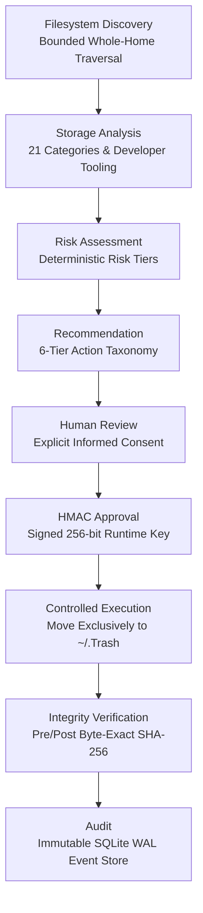

# MacGuard AI

**Safety-first agentic storage intelligence for macOS.**

[](https://www.python.org/)
[](https://streamlit.io/)
[](TESTING.md)
[](SECURITY.md)
[](README.md)
[](CHANGELOG.md)
[](#-license)

MacGuard AI is a safety-first, agentic macOS storage intelligence platform designed to help users understand storage consumption, analyze developer environments, identify redundancy and duplicate clusters, track historical storage trends, and make informed cleanup decisions **without giving AI unrestricted filesystem authority**.

> **AI is the advisor, not the authority.**  
> MacGuard AI decouples diagnostic reasoning from execution authority: AI agents can inspect, explain, prioritize, and summarize filesystem telemetry, but they possess **zero authority to approve, move, or delete files**.

---

## ⚡ Why This Project is Different

Traditional storage cleanup utilities and emerging "autonomous AI cleaners" present severe data loss risks by combining black-box heuristics with unsupervised deletion primitives (`rm -rf`, `os.remove`, `unlink`). A single hallucinated path, ambiguous rule, or prompt injection can permanently destroy active developer environments, uncommitted code repositories, Docker containers, or personal documents.

```text
Traditional Cleanup Tool:
User ─────────► Tool ─────────► Filesystem Mutation (Permanent Deletion)

MacGuard AI Architecture:
User ──► AI Intelligence ──► Recommendation ──► Human Review ──► HMAC Sign ──► Safety Validation ──► Controlled Trash ──► Verification ──► Audit
```

MacGuard AI replaces blind automation with a **formally verifiable, human-governed execution pipeline**:

* **Human-in-the-Loop Sovereign Gate**: Cleanup requires conscious, per-item human confirmation with an Informed Consent declaration. Bulk "Approve All" actions are strictly prohibited.
* **Deterministic Foundations Before AI**: All scanning, risk scoring, path allowlisting, duplicate detection, and execution logic are 100% deterministic Python code. The AI agent acts strictly as an advisory explainer.
* **Cryptographic Authorization**: Approvals are sealed with runtime HMAC-SHA256 signatures bound to canonical path, operation, risk level, and a 15-minute expiration timestamp using an isolated 256-bit secret key (`ApprovalKeyManager`).
* **Single-Use Replay Protection**: Tokens atomically transition `PENDING` $\rightarrow$ `APPROVED` $\rightarrow$ `CONSUMED`. Replay execution attempts fail closed.
* **Zero Permanent Deletion Primitives**: The codebase contains **zero** occurrences of `os.remove`, `os.unlink`, `shutil.rmtree`, or shell `rm`. All operations route exclusively to macOS Trash (`~/.Trash`).
* **Pre- & Post-Mutation Physical Integrity**: Snapshots of file size, inode, modification time, and SHA-256 hashes are verified before and after moving to Trash.
* **Anti-Symlink & TOCTOU Defense**: Traversal and execution inspect filesystem items with non-following `os.lstat()`. Symlink swaps and path traversals fail closed immediately.
* **Persistent Tamper-Evident Audit Logging**: All scanning, recommendation, approval, dry-run, execution, and verification events are recorded in a local WAL-mode SQLite database with zero secret leakage.

---

## 🛡️ Safety & Execution Architecture

MacGuard AI enforces a linear, unidirectional security gating pipeline where discovery never equals authorization:



### Fundamental Security Axiom
$$\text{DISCOVERY} \neq \text{AUTHORIZATION} \neq \text{RECOMMENDATION} \neq \text{APPROVAL} \neq \text{EXECUTION}$$

---

## 🧭 Four Segregated Operating Modes

MacGuard AI strictly isolates capabilities across four operating modes:

```text
┌─────────────────────────┐       ┌─────────────────────────┐       ┌─────────────────────────┐       ┌─────────────────────────┐
│         ANALYZE         │       │          AGENT          │ ───>  │         REVIEW          │ ───>  │          CLEAN          │
│       (Read-Only)       │       │    (Conversational AI)  │       │   (Human Confirmation)  │       │    (Controlled Trash)   │
│  - ScanScope Discovery  │       │  - Analytical Tools     │       │  - Inspect Recs & Risk  │       │  - Integrity Validation │
│  - 21 Smart Categories  │       │  - Trend & Delta Q&A    │       │  - Local AI Context     │       │  - Atomic Token Claim   │
│  - Developer Artifacts  │       │  - Injection Defense    │       │  - Explicit HMAC Sign   │       │  - Move to ~/.Trash     │
│  - Duplicate Explorer   │       │  - Zero Exec Authority  │       │  - ZERO Mutations       │       │  - Post-Move Verify     │
│  - Storage History      │       │                         │       │                         │       │  - SQLite Audit Logging │
└─────────────────────────┘       └─────────────────────────┘       └─────────────────────────┘       └─────────────────────────┘
```

1. **`ANALYZE` (Read-Only Diagnostics)**: Evaluates mounted disk capacity, performs bounded traversal across user-selected `ScanScope`s, classifies items into 21 semantic categories with safe `UNKNOWN` fallback, inspects developer tooling, detects duplicate clusters, and records historical snapshots. Zero mutations occur.
2. **`AGENT` (Conversational Intelligence)**: Multi-turn natural language assistant powered by local Ollama or deterministic fallback. Answers questions about storage growth, developer environments, duplicate clusters, and scan deltas using strictly allowlisted read-only analytical tools. Zero execution authority.
3. **`REVIEW` (Human Confirmation & HMAC Gate)**: Translates findings into explainable recommendations with 6-tier risk badges, rationales, and parent-child container hierarchy deduplication. Users inspect findings, acknowledge Informed Consent, and generate single-use HMAC-SHA256 approval tokens.
4. **`CLEAN` (Controlled Execution & Verification)**: Re-validates path allowlists, executes non-destructive Dry Run simulations, performs verified moves to `~/.Trash`, verifies destination hash integrity, and records immutable SQLite audit records.

---

## 🚀 Key Feature Areas

### 🔍 Storage Intelligence
* **Bounded Whole-Home Discovery**: High-performance filesystem walker using bounded min-heaps (`heapq`), `ScanScope` configurations (`HOME`, `DEV`, `APP_DATA`, `CACHE`, `CUSTOM`), and strict `TraversalLimits` (depth bounds, item caps, timeouts).
* **Smart Categorization Registry**: Deterministic 21-category classification engine (`CACHES`, `LOGS`, `BUILD_ARTIFACTS`, `PACKAGE_MANAGERS`, `VIRTUAL_ENVIRONMENTS`, `CONTAINERS`, `DISK_IMAGES`, `ML_AI_DATA`, `ARCHIVES`, `DOCUMENTS`, `DOWNLOADS`, `DESKTOP`, `PICTURES`, `MOVIES`, `MUSIC`, `MEDIA`, `DEVELOPER_DATA`, `APPLICATIONS`, `TEMPORARY_DATA`, `SYSTEM_DATA`, `USER_DATA`) with confidence scoring and safe `UNKNOWN` fallback.
* **Large File Intelligence**: Outlier detection and size ranking for large files across bounded scopes without loading large files into memory.

### 👨💻 Developer Storage Intelligence
* **Developer Artifact Analysis**: Specialized breakdown of Xcode `DerivedData`, Docker container layers and disk images, Python `.venv` virtual environments, Node `node_modules`, Rust `target` builds, and local ML model caches (Hugging Face, Ollama, PyTorch).
* **Project Association**: Automatic detection of project root manifests (`package.json`, `pyproject.toml`, `Cargo.toml`, `.git`) to contextualize build artifacts.
* **Staleness & Staleness Indicators**: Calculates access times, build ages, and staleness to differentiate active working environments from abandoned build caches.
* **Logical vs. Physical Storage Accounting**: Accurately differentiates logical directory sizes from physical APFS space allocations.

### 🧬 Duplicate & Redundancy Intelligence
* **Multi-Stage Duplicate Detection**: Streaming two-stage hashing algorithm (size grouping ➔ 4KB partial header hash ➔ full SHA-256 verification) for zero-memory-spike duplicate discovery.
* **APFS Hardlink Recognition**: Detects shared physical inodes (`st_nlink > 1`, identical `(st_dev, st_ino)`), correctly accounting for hardlinks as **zero additional wasted bytes**.
* **Reclaimable-Byte Estimation**: Computes true potential physical space reclamation across duplicate clusters without misclassifying hardlinks.
* **Evidence-Only Invariant**: Duplicate detection provides diagnostic evidence only; it never creates independent deletion authority.

### 📊 Storage History & Trends
* **Persistent Storage Snapshots**: Stores multi-scan snapshots in a local SQLite database (Schema v2: `scan_snapshots`, `category_history`, `top_consumer_snapshots`).
* **Category Growth Velocity**: Tracks growth and shrinkage trends over time with velocity badges (`GROWING`, `SHRINKING`, `STABLE`).
* **Scan-to-Scan Comparisons**: Instant delta analysis comparing current storage utilization against previous scans to catch disk leaks early.

### 🤖 Advisory Agentic Intelligence
* **Conversational Storage Reasoner**: Natural-language assistant equipped with 12 allowlisted, read-only analytical tools:
  - `get_storage_overview`
  - `get_storage_candidates`
  - `get_candidate_details`
  - `get_category_summary`
  - `get_large_files`
  - `get_recommendations`
  - `get_audit_summary`
  - `get_safety_policies`
  - `get_storage_trends`
  - `compare_scans`
  - `get_duplicate_summary`
  - `get_developer_storage_summary`
* **Prompt Injection Defenses**: Multi-layer input validation, regex sanitization, untrusted telemetry delimiter wrapping (`<storage_analysis_data>`), and output bounds scanning.
* **Resilient Local AI & Offline Fallback**: Connects to local [Ollama](https://ollama.ai) (`llama3.2` / `mistral`) for contextual explanations, automatically degrading to rule-based rationales if Ollama is offline or times out (>30s).
* **Zero Authority Rule**: The agent has **zero mutation tools, zero approval authority, zero deletion primitives, and zero access to HMAC keys**.


---

## 🖥️ Streamlit Web Application Views

The Streamlit web interface provides 10 dedicated views with two-phase navigation synchronization:

| View | Purpose | Mode |
|---|---|:---:|
| **📊 Dashboard** | Executive capacity gauges, disk utilization percentages, actionable reclaimable totals, and primary workflow launchpads. | `ANALYZE` |
| **🔍 Scan Storage** | Granular storage scanning via configurable `ScanScope`, interactive Altair category/risk charts, and largest-consumer tables. | `ANALYZE` |
| **📦 Developer Storage** | Dedicated inspector for Xcode, Docker, Python virtualenvs, Node modules, Rust targets, and ML model caches. | `ANALYZE` |
| **👥 Duplicate Explorer** | Deduplicated cluster view, APFS hardlink badges, zero-wasted-byte indicators, and streaming SHA-256 analysis. | `ANALYZE` |
| **📈 Storage Intelligence & History** | Multi-scan historical snapshots, trend delta indicators (`GROWING`, `SHRINKING`, `STABLE`), and top storage growth insights. | `ANALYZE` |
| **💡 Recommendations** | Explainable findings using the 6-tier action taxonomy, container deduplication, and on-demand local AI explanations. | `REVIEW` |
| **🛡️ Human Review** | Informed Consent confirmation, candidate inspection cards, individual approval buttons, and queue separation. | `REVIEW` |
| **🗑️ Controlled Execution** | Real-time safety lifecycle banner, non-destructive Dry Run simulation, and verified Trash execution. | `CLEAN` |
| **🤖 AI Agent** | Conversational storage reasoner with capability boundary indicators, quick analytical prompts, and trend summaries. | `AGENT` |
| **📜 Audit Log** | Searchable, filterable event viewer displaying cryptographic timestamps, approval IDs, actions, and integrity verification statuses. | `ANALYZE` |
| **⚙️ Settings** | System diagnostics, non-disableable safety policy guarantees, and runtime engine health. | `ANALYZE` |

---

## 🔒 12 Core Security Invariants

| # | Invariant | Enforcement Mechanism |
|---|---|---|
| **1** | **Zero Permanent Deletion Primitives** | Codebase contains **zero** instances of `os.remove`, `os.unlink`, `Path.unlink`, `Path.rmdir`, `shutil.rmtree`, or shell `rm`. All mutations route exclusively to macOS Trash (`~/.Trash`). |
| **2** | **Zero Subprocess / Shell Execution** | No `os.system`, `subprocess.Popen`, `subprocess.run`, or shell invocations exist in the entire application. |
| **3** | **Zero Agent Mutation Authority** | The AI agent can inspect, explain, summarize, and prioritize storage findings. It cannot approve or execute cleanup. |
| **4** | **Mandatory Human Approval** | Implicit, conversational, or bulk ("Approve All") authorizations are strictly prohibited. Every item requires conscious, individual human confirmation. |
| **5** | **Cryptographic HMAC-SHA256 Authorization** | Every approval is cryptographically signed using an ephemeral 256-bit runtime secret key (`ApprovalKeyManager`) binding canonical path, operation, risk level, and expiration. |
| **6** | **Strict Single-Use Replay Protection** | Tokens atomically transition from `PENDING` $\rightarrow$ `APPROVED` $\rightarrow$ `CONSUMED`. Re-execution of a consumed token is immediately blocked. |
| **7** | **Allowlist & Denylist Boundary Enforcement** | Mutations are confined to explicit allowlisted cache and log roots (`~/Library/Caches`, `~/Library/Logs`, `~/.cache`, `DerivedData`). System roots and user documents are permanently blocked. |
| **8** | **Anti-Symlink Traversal Protection** | File operations inspect targets using `os.lstat()`. Symlinks are strictly prohibited from being followed or targeted for mutation. |
| **9** | **Time-of-Check to Time-of-Use (TOCTOU) Protection** | Pre-execution verification re-evaluates the target allowlist, file existence, inode, size, and SHA-256 hash immediately prior to moving. |
| **10** | **Pre/Post Physical Integrity Verification** | Byte-exact SHA-256 hash digests are verified before and after moving to Trash. Content mismatch results in immediate failure. |
| **11** | **Controlled Trash Destination** | All moves target uniquely segregated subdirectories inside `~/.Trash/MacGuard_<approval_id>_<token>`. |
| **12** | **Persistent Tamper-Evident Audit Logging** | All scanning, recommendation, approval, dry-run, execution, and verification events are recorded in a local WAL-mode SQLite database with zero secret leakage. |

---

## 🛠️ Installation & Setup

### Prerequisites
* **macOS 12.0+** (Apple Silicon or Intel)
* **Python 3.11** or later
* **Git**
* *(Optional)* [Ollama](https://ollama.ai) with `llama3.2` or `mistral` for local natural-language explanations (MacGuard operates 100% offline if Ollama is absent).

### 1. Clone the Repository
```bash
git clone https://github.com/your-username/macguard-ai.git
cd macguard-ai
```

### 2. Create and Activate Virtual Environment
```bash
python3 -m venv .venv
source .venv/bin/activate
```

### 3. Install Dependencies
```bash
pip install -r requirements.txt
```

---

## 💻 Running MacGuard AI

### 1. Interactive Streamlit Web Interface (Canonical Launcher)
```bash
streamlit run streamlit_app.py
```
Or run headlessly:
```bash
.venv/bin/python -m streamlit run streamlit_app.py --server.headless true --server.port 8501
```
Open **`http://localhost:8501`** in your browser.

### 2. Command-Line Interface (CLI)
```bash
# Diagnostic storage overview (Read-only)
python -m app.cli

# Interactive human review with dry-run simulation
python -m app.cli --review

# Interactive human review with controlled move to macOS Trash
python -m app.cli --trash

# View persistent SQLite audit log
python -m app.cli --audit
```

---

## 🧪 Presentation Demo Dataset (Zero-Risk Live Demo)

MacGuard AI includes a built-in synthetic dataset generator for live presentations, code walkthroughs, and portfolio demonstrations without touching real personal files:
1. Open the web interface at `http://localhost:8501`.
2. In the sidebar, click **"🧪 Load Presentation Demo Data"**.
3. Explore populated findings across all 4 modes, test the Dry Run simulator, and observe the safety engine in action with complete isolation.

---

## 🧪 Test Suite & Quality Assurance

The codebase is validated by **592 automated tests** covering security, fuzzing, UI state lifecycle, performance benchmarking, and real filesystem execution:

```bash
# Run full automated test suite (592 tests)
PYTHONPATH=. .venv/bin/pytest

# Run dedicated security & safety suite (73 tests)
PYTHONPATH=. .venv/bin/pytest \
  tests/test_safety.py \
  tests/test_agent_security.py \
  tests/test_execution_security.py \
  tests/test_mutation_guard.py \
  tests/test_integrity.py \
  tests/test_path_fuzzing.py \
  tests/test_sandbox_final_validation.py \
  tests/test_trash_executor.py -v

# Run UI integration test suite (77 tests)
PYTHONPATH=. .venv/bin/pytest \
  tests/test_ui_v11.py \
  tests/test_storage_intelligence_ui.py \
  tests/test_ui_integration.py -v

# Run performance & hardening suite (32 tests)
PYTHONPATH=. .venv/bin/pytest \
  tests/test_performance_v11.py \
  tests/test_performance_benchmarks.py -v
```

### Static AST Safety Scan
Run the repository's static AST safety scan to verify zero dangerous primitives across `app/`:
```bash
python3 -c '
import ast, os, sys
violations = []
for root, _, files in os.walk("app"):
    for f in files:
        if f.endswith(".py"):
            path = os.path.join(root, f)
            with open(path, "r", encoding="utf-8") as fp:
                tree = ast.parse(fp.read(), filename=path)
            for node in ast.walk(tree):
                if isinstance(node, ast.Import):
                    for alias in node.names:
                        if alias.name == "subprocess":
                            violations.append((path, node.lineno, "import subprocess"))
                elif isinstance(node, ast.ImportFrom):
                    if node.module and "subprocess" in node.module:
                        violations.append((path, node.lineno, f"from {node.module}"))
                if isinstance(node, ast.Call):
                    if isinstance(node.func, ast.Name):
                        if node.func.id in ("eval", "exec", "compile"):
                            violations.append((path, node.lineno, f"{node.func.id}()"))
                    elif isinstance(node.func, ast.Attribute):
                        attr = node.func.attr
                        if attr in ("unlink", "rmdir", "system", "popen"):
                            if isinstance(node.func.value, ast.Name) and node.func.value.id == "os":
                                violations.append((path, node.lineno, f"os.{attr}()"))
                        if attr == "rmtree":
                            violations.append((path, node.lineno, "shutil.rmtree()"))
                    for kw in node.keywords:
                        if kw.arg == "shell" and isinstance(kw.value, ast.Constant) and kw.value.value is True:
                            violations.append((path, node.lineno, "shell=True"))
if violations:
    print(f"FAILED: Found {len(violations)} safety violations")
    sys.exit(1)
else:
    print("SUCCESS: 0 forbidden dangerous primitives found across app/")
'
```

---

## ⚠️ Current Scope & Limitations

* **macOS Focused**: Tailored specifically for macOS directory structures (`~/Library/Caches`, `~/Library/Logs`, `~/.Trash`, Xcode `DerivedData`, APFS hardlinks).
* **Controlled Trash Only**: Permanent deletion is permanently omitted by design. Reclaimed items remain in `~/.Trash` until the user manually empties Trash via Finder.
* **Cleanup Authority Narrower Than Analysis**: MacGuard analyzes storage broadly across disk mounts via `ScanScope`, but cleanup permissions are strictly confined to allowlisted cache and temporary build directories. Personal user files (`Documents`, `Desktop`, `Downloads`, `Pictures`, `Movies`, `Music`) and core system paths (`/System`, `/Applications`, `/usr`, `/Library`) are permanently blocked from automated cleanup.
* **Local Ollama is Optional**: Natural language explanation features use local Ollama when available, but automatically fall back to deterministic rule-based rationales with zero loss of functionality if Ollama is offline or times out.

---

## 📚 Documentation Index

* [**ARCHITECTURE.md**](ARCHITECTURE.md): Full system architecture, component breakdown, data flow, SQLite Schema v2, and cryptographic models.
* [**SECURITY.md**](SECURITY.md): Formal security policy, threat boundaries (T1–T29), 12 core security invariants, and fail-closed policies.
* [**USER_GUIDE.md**](USER_GUIDE.md): End-to-end user manual for all 4 operating modes, 10 UI views, Dry Run simulation, and Trash recovery.
* [**TESTING.md**](TESTING.md): Comprehensive test hierarchy, 592-test suite breakdown, verification commands, and health checks.
* [**DEMO.md**](DEMO.md): 3–5 minute presentation and interview demonstration script with Developer Storage, Trends, and Duplicates.
* [**SAFETY.md**](SAFETY.md): Safety specification, operating mode isolation, and recommendation taxonomy.
* [**CHANGELOG.md**](CHANGELOG.md): Complete milestone history including v1.1.0 release notes.

---

## 📄 License

MIT License. Designed with safety, user sovereignty, and transparency at its core.
