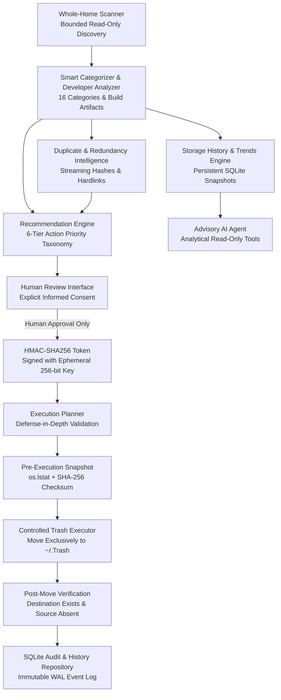

# MacGuard AI

A safety-first, agentic storage intelligence and management system for macOS.

MacGuard AI empowers macOS users to understand, analyze, and safely reclaim storage space without the risk of accidental data loss. Built on the core principle that **AI must never possess unsupervised filesystem deletion authority**, MacGuard decouples diagnostic intelligence from execution, enforcing deterministic safety policies, granular risk assessments, cryptographic HMAC-SHA256 authorizations, pre/post-mutation integrity checks, and mandatory human consent for every action.

> **Status**: **Production Ready (v1.1.0)**  
> Verified with **592/592 passing automated tests**, a dedicated **73-test security and safety suite**, **77 UI integration tests**, **32 performance and hardening tests**, zero permanent deletion primitives, zero shell execution, and 100% prompt injection resistance.

---

## The Problem: Why Traditional Storage Cleaners Are Dangerous

Traditional macOS cleanup utilities and emerging "AI cleaners" suffer from critical safety flaws:
1. **Black-Box Heuristics:** Blindly purge directories matching generic names without understanding workspace or build context (e.g., deleting active developer `.venv` virtual environments, `node_modules`, Docker layers, or Xcode build caches without warning).
2. **Hardcoded Permanent Deletion (`rm -rf`):** Direct invocation of irreversible deletion primitives (`rm`, `os.remove`, `unlink`). If a rule misfires, user or project data is permanently lost.
3. **Unbounded AI Agents:** Emerging autonomous agents given arbitrary shell, terminal, or subprocess access create severe attack surfaces for prompt injection, hallucinated paths, and catastrophic accidental deletions.
4. **Zero Auditability & Integrity:** No cryptographic authorization records or physical integrity snapshots exist to prove what was approved versus what was altered.

---

## MacGuard AI's Human-Authority Architecture

MacGuard AI flips this paradigm: **the AI agent can inspect, explain, summarize, and prioritize storage findings, but it cannot approve or execute cleanup.**



### 🔒 Core Safety Invariants

1. **Zero Permanent Deletion Primitives:** The codebase contains **zero** instances of `os.remove`, `os.unlink`, `Path.unlink`, `Path.rmdir`, `shutil.rmtree`, or shell `rm`. Mutations route exclusively to macOS Trash (`~/.Trash`).
2. **Zero Subprocess / Shell Execution:** No `os.system`, `subprocess.Popen`, `subprocess.run`, or shell invocations exist in the entire application.
3. **Zero-Authority AI Assistant:** The LLM (via local Ollama or deterministic fallback) is strictly read-only and advisory. It cannot approve, delete, move, or modify files.
4. **Cryptographic HMAC-SHA256 Approvals:** Every human approval generates a tamper-evident token bound to canonical path, operation, risk level, and a 15-minute expiration using an isolated 256-bit runtime secret key (`ApprovalKeyManager`).
5. **Pre- and Post-Mutation Physical Integrity Checks:** Exact file size, inode, modification time, and SHA-256 hashes are verified before and after moving to Trash.
6. **Mandatory Explicit Human Approval (No "Approve All"):** Bulk approvals and auto-approvals are strictly prohibited. Users must individually inspect candidates and grant explicit consent.
7. **Fail-Closed Mechanics:** Any integrity mismatch, symlink anomaly, expired approval token, or unknown risk immediately blocks execution safely.

---

## Four Canonical Operating Modes

MacGuard AI provides four strictly segregated operating modes across its workflow:

```text
┌─────────────────────────┐       ┌─────────────────────────┐       ┌─────────────────────────┐       ┌─────────────────────────┐
│         ANALYZE         │       │          AGENT          │ ───>  │         REVIEW          │ ───>  │          CLEAN          │
│       (Read-Only)       │       │    (Conversational AI)  │       │   (Human Confirmation)  │       │    (Controlled Trash)   │
│  - ScanScope Discovery  │       │  - Analytical Tools     │       │  - Inspect Recs & Risk  │       │  - Integrity Validation │
│  - 16 Smart Categories  │       │  - Trend & Delta Q&A    │       │  - Local AI Context     │       │  - Atomic Token Claim   │
│  - Developer Artifacts  │       │  - Injection Defense    │       │  - Explicit HMAC Sign   │       │  - Move to ~/.Trash     │
│  - Duplicate Explorer   │       │  - Zero Exec Authority  │       │  - ZERO Mutations       │       │  - Post-Move Verify     │
│  - Storage History      │       │                         │       │                         │       │  - SQLite Audit Logging │
└─────────────────────────┘       └─────────────────────────┘       └─────────────────────────┘       └─────────────────────────┘
```

1. **`ANALYZE` (Read-Only Diagnostics)**: Evaluates mounted disk capacity, scans directory trees via bounded `ScanScope`, identifies large files, classifies items into 16 semantic categories, inspects developer tooling (`.venv`, `node_modules`, `DerivedData`, ML weights), detects duplicates, and records historical snapshots. Zero mutations occur.
2. **`AGENT` (Conversational Intelligence)**: Interactive natural-language reasoning powered by local LLMs (Ollama) or deterministic fallback. Answers questions (*"What is consuming my storage?"*, *"How much did caches grow since last scan?"*, *"Which duplicate clusters waste the most space?"*) with strictly allowlisted, read-only diagnostic tools.
3. **`REVIEW` (Human Confirmation & HMAC Gate)**: Presents flagged candidates with 6-tier risk badges, rationales, historical context, and parent-child hierarchy tracking. Users inspect findings, acknowledge the Informed Consent declaration, and generate single-use HMAC-SHA256 approval tokens.
4. **`CLEAN` (Controlled Execution & Verification)**: Re-validates path allowlists, executes non-destructive Dry Run simulations, performs controlled moves to `~/.Trash`, verifies source absence and destination hash integrity, and records immutable SQLite audit logs.

---

## Implemented Streamlit UI Views

The Streamlit web interface provides 10 dedicated views with two-phase navigation synchronization:

* **📊 Dashboard**: Executive capacity gauges, disk utilization percentages, actionable reclaimable totals, and primary workflow launchpads.
* **🔍 Scan Storage**: Granular storage scanning via configurable `ScanScope`, interactive Altair charts for category distributions (MB/GB) and risk tiers, and readable largest-consumer tables.
* **📦 Developer Storage**: Dedicated inspector for Xcode, Docker, Python virtualenvs, Node modules, Rust target caches, and ML model weights with project associations and staleness indicators.
* **👥 Duplicate Explorer**: Deduplicated cluster view, APFS hardlink badges, zero-wasted-byte indicators, and streaming SHA-256 analysis.
* **📈 Storage Intelligence & History**: Multi-scan historical snapshots, trend delta indicators (`GROWING`, `SHRINKING`, `STABLE`), and top storage growth insights.
* **💡 Recommendations**: Explainable findings using the 6-tier action priority taxonomy, hierarchy deduplication, and on-demand Local AI explanations with offline deterministic fallback.
* **🛡️ Human Review**: Informed Consent confirmation, candidate inspection cards, individual approval buttons, and clear queue separation for eligible, manual-caution, and safety-blocked items.
* **🗑️ Controlled Execution**: Real-time safety lifecycle banner (`Review ➔ Approve ➔ Dry Run ➔ Controlled Trash ➔ Integrity Verification ➔ Audit`), non-destructive Dry Run simulations, and verified Trash execution.
* **🤖 AI Agent**: Chat interface with capability boundary indicators, quick analytical prompts, and conversational storage analysis.
* **📜 Audit Log**: Searchable, filterable event viewer displaying cryptographic timestamps, approval IDs, actions, and integrity verification statuses.
* **⚙️ Settings**: System diagnostics, non-disableable safety policy guarantees, and runtime engine health.

---

## Installation & Setup

### Prerequisites
* macOS 12.0+ (Apple Silicon or Intel)
* Python 3.11 or later
* Git
* *(Optional)* [Ollama](https://ollama.ai) with `llama3.2` or `mistral` for local natural-language explanations (MacGuard operates 100% offline if Ollama is absent).

### 1. Clone the Repository
```bash
git clone https://github.com/your-username/macguard-ai.git
cd macguard-ai
```

### 2. Create and Activate Virtual Environment
```bash
python3 -m venv .venv
source .venv/bin/activate
```

### 3. Install Dependencies
```bash
pip install -r requirements.txt
```

---

## Running MacGuard AI

### 1. Interactive Streamlit Web Interface (Canonical Launcher)
```bash
streamlit run streamlit_app.py
```
Or run headlessly on port 8501:
```bash
.venv/bin/python -m streamlit run streamlit_app.py --server.headless true --server.port 8501
```
Open **`http://localhost:8501`** in your browser.

### 2. Command-Line Interface (CLI)
```bash
# Diagnostic storage overview (Read-only)
python -m app.cli

# Interactive human review with dry-run simulation
python -m app.cli --review

# Interactive human review with controlled move to macOS Trash
python -m app.cli --trash

# View persistent SQLite audit log
python -m app.cli --audit
```

---

## Presentation Demo Dataset (Zero-Risk Live Demo)

MacGuard AI includes a built-in synthetic dataset generator for live presentations, code walkthroughs, and portfolio demonstrations without touching real personal files:
1. Open the web interface at `http://localhost:8501`.
2. In the sidebar, click **"🧪 Load Presentation Demo Data"**.
3. Explore populated findings across all 4 modes, test the Dry Run simulator, and observe the safety engine in action with complete isolation.

---

## Test Suite & Quality Assurance

The codebase is validated by **592 automated tests** covering security, fuzzing, UI state lifecycle, performance benchmarking, and real filesystem execution:

```bash
# Run full automated test suite (592 tests)
.venv/bin/python -m pytest -q

# Run dedicated security & integrity suite (73 tests)
.venv/bin/python -m pytest \
  tests/test_execution_security.py \
  tests/test_agent_security.py \
  tests/test_mutation_guard.py \
  tests/test_safety.py \
  tests/test_path_fuzzing.py \
  tests/test_trash_executor.py \
  tests/test_integrity.py \
  tests/test_sandbox_final_validation.py -v

# Run UI integration test suite (77 tests)
.venv/bin/python -m pytest tests/test_ui_v11.py tests/test_storage_intelligence_ui.py tests/test_ui_integration.py -v

# Run performance & hardening suite (32 tests)
.venv/bin/python -m pytest tests/test_performance_v11.py tests/test_performance_benchmarks.py -v
```

### Test Coverage Highlights
* **Security & Safety Invariant Suite (73 tests)**: TOCTOU symlink race attacks (Scenarios A–F), path traversal escapes, unicode normalization fuzzing, concurrent approval claim protection, single-use token consumption, and runtime secret key isolation.
* **Performance & Hardening Suite (32 tests)**: Memory footprint profiling ($<150\text{ MB}$ RSS, $<50\text{ MB}$ heap across 10k items), cooperative cancellation ($<100\text{ ms}$ latency), symlink loop defense, and 10 adversarial prompt injection attack vectors.
* **UI & State Lifecycle Suite (77 tests)**: Navigation synchronization, widget lifecycle safety, zero-bound Altair charts, path redaction, and error resilience.
* **Real-World Sandbox Validation**: Automated end-to-end acceptance testing across all safety gates.

---

## Current Scope & Limitations

* **macOS Focused**: Tailored specifically for macOS directory structures (`~/Library/Caches`, `~/Library/Logs`, `~/.Trash`, Xcode `DerivedData`, APFS hardlinks).
* **Controlled Trash Only**: Permanent deletion is permanently omitted by design. Reclaimed items remain in `~/.Trash` until the user manually empties Trash via Finder.
* **Cleanup Authority Narrower Than Analysis**: MacGuard analyzes storage broadly across disk mounts, but cleanup permissions are strictly confined to allowlisted cache and temporary build directories. Personal user files (`Documents`, `Desktop`, `Downloads`, `Pictures`, `Movies`, `Music`) and core system paths (`/System`, `/Applications`, `/usr`, `/Library`) are permanently blocked from automated cleanup.
* **Local Ollama is Optional**: Natural language explanation features use local Ollama when available, but automatically fall back to deterministic rule-based rationales with zero loss of functionality if Ollama is offline or times out.

---

## Documentation Index

* [**ARCHITECTURE.md**](ARCHITECTURE.md): Full system architecture, component breakdown, data flow, and cryptographic models.
* [**SECURITY.md**](SECURITY.md): Formal security philosophy, threat boundaries, 12 core security invariants, and fail-closed policies.
* [**USER_GUIDE.md**](USER_GUIDE.md): End-to-end user manual for all 4 operating modes, Dry Run simulation, and Trash recovery.
* [**TESTING.md**](TESTING.md): Comprehensive test hierarchy, 592-test suite breakdown, and test commands.
* [**DEMO.md**](DEMO.md): 3–5 minute presentation and interview demonstration script with Developer Storage, Trends, and Duplicates.
* [**SAFETY.md**](SAFETY.md): Safety specification, operating mode isolation, and recommendation taxonomy.
* [**CHANGELOG.md**](CHANGELOG.md): Complete milestone history including v1.1.0 release notes.

---

## License

MIT License. Designed with safety, user sovereignty, and transparency at its core.
